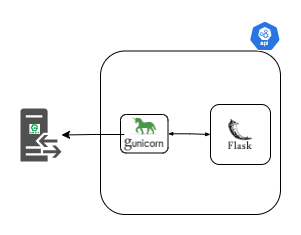

# CSV Merger API

## Design
<p align="center">
 
</p>

<br/>

This Dockerized Python application is used for merging CSVs files into a single file. It utilizes an Nginx web server and gunicorn to send & receive API requests. The docker-compose file is built to be used within a docker-swarm instance. However you can run this as a container using the overridden  compose file.

## Usage

### 1. Create python virtual environment within the server directory

#### Mac

```bash
   $ python -m venv venv
```

#### Windows

```bash
   py -3 -m venv venv
```

### 2. Startup the virtual environment

#### Mac

```bash
   $ . venv/bin/activate
```

#### Windows

```bash
   $ {path\to\project\folder}\venv\Scripts\activate
```

### 3. Install python dependencies

While venv is activated execute the following command

#### Mac

```bash
   $ pip install -r requirements.txt
```

#### Windows

```bash
   pip install -r requirements.txt (make sure your python version is compatible with packages in .txt file)
   pip install flask
```

### 4. Shutting down venv

Navigate within the server directory

#### Mac & Windows

```bash
$ deactivate
```

## Running application locally

#### Mac

```bash
$ venv/bin/flask run --no-debugger
```

#### Windows

your `.flaskenv` file will have to look like

```
    FLASK_APP=app.py
    FLASK_ENV=development
```

you will have to install

```
    pip install python-dotenv
```

To Run

```
$ flask --app app.py run -p 5020
```

see

```
    https://www.techcoil.com/blog/how-to-use-a-python-3-virtual-environment-in-windows-10/
```

### Run application via Docker
```bash
# Ensure your .env file is populated with DOCKER_USERNAME the create your docker image 
$ make docker-image

# Run your docker container
$ start-container

# Utilize endpoint on Port 8080
$ curl http://localhost:8080/

# Delete container
$ make destroy-container
```

### Running tests
```bash
# Runs all tests
$ make test
```

# Making Code Changes

* Make sure to update the VERSION before merging